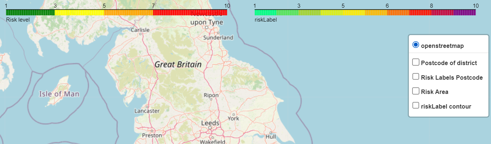

<p align="center">
  <br>
  
</p>

<p align="center">
  <a href="#"></a>
  <a href="#"></a>
  <a href="#"></a>
</p>

## Basic Overview
`flood_tool` is designed to assess flood risks in the UK. It uses machine learning algorithms on environmental data collected across the UK. The tool also provides interactive visual representations of the potential flood risk as well as the spatial distribution of the severity of flood risks across the UK.

### Key Features

- Analysis of various flood sources including surface water, rivers, and seas within the UK
- Utilisation of topographic and environmental data with machine learning models
- Visualisation of flood risk across the UK
 
<br><p align="center">
  
</p>

## Installation Guide

To use `flood_tool`, follow these steps:

1. **Clone the Repository**

Begin by cloning the `flood_tool` repository from GitHub:
```bash
git clone https://github.com/ese-msc-2023/ads-deluge-nene.git
cd flood_tool
```
2. **Creating Environment**

- Conda Environment:
```bash
conda env create -f environment.yml
conda activate deluge
```
- Install Packages via pip:
```bash
pip install -r requirements.txt
```
3. **Testing Installation**

After installing `flood_tool`, test your installation by running the following test

```bash
python -m pytest -v flood_tool/tests/test_installation.py
```

## Installation

#### 1. Importing the Package

Start by importing the necessary modules from the package:

```python
from flood_tool import Tool

```
#### 2. Initalising the Tool

Create an instance of the main tool for flood risk analysis:
```python
flood_tool = Tool()
```
## Usage

### tool.py
This section provides guidance on how to use the `flood_tool` package for flood risk analysis.

#### 1. Analysing Flood Risks

To analyse flood risks for specific postcodes:
```python
postcodes = ['M34 7QL', 'OL4 3NQ'] 
risk_classes = flood_tool.predict_flood_class_from_postcode(postcodes, method="gradient_booster")
```

#### 2. Annual Flood Risks
PUT THE CODE HERE

### Other Methods
#### Predicting House Prices

Predict median house prices for postcodes:
```python
house_prices = flood_tool.predict_median_house_price(postcodes)
```

#### Predicting Local Authority
Predict the local authority that an arbitrary location (northing & easting):
```python
easting, northing = [393470], [394371] 
local_authority = flood_tool.predict_local_authority(easting, northing)
```

#### Historical Flooding
Determine if a location has experienced flooding historically:
```python
historical_flooding = flood_tool.predict_historic_flooding(postcodes)
```

#### Collating Multiple Outputs
Collate outputs from the various methods into a single dataframe:
```python
collated_data = flood_tool.collate_outputs()
```

### geo.py

Contains functions that help the conversion between GPS (WGS83) coordinates, and the OS National Grid (OSGB36) coordinates allowing flexible location analysis in the UK.

#### Key Methods

- **get_easting_northing_from_gps_lat_long** : Converts latitude and longitude from the GPS coordinate system to eastings and northings in the OSGB36 system

- **get_gps_lat_long_from_easting_northing** : Converts eastings and northings from the OSGB36 system back to latitude and longitude in the GPS coordinate system.

These functions are used within the **'Tool'** class to assist predicting flood risks in specific UK locations by aligning them with the required co-ordinate system.

#### Example Usage of geo.py Functions

#### Converting GPS Coordinates to OSGB36 Eastings and Northings

To convert a GPS location given in latitude and longitude to the UK's Ordnance Survey eastings and northings:

```python
from flood_tool.geo import get_easting_northing_from_gps_lat_long

# Example GPS coordinates for Imperial College London
latitude = 51.497799
longitude = -0.179220

easting, northing = get_easting_northing_from_gps_lat_long(latitude, longitude)

print(f"The OSGB36 easting and northing for Imperial College London are {easting}, {northing}.")
```

## Models

The `flood_tool` package uses a variety of machine learning models for predicting flood risks and house prices. Here is an overview of the models currently available within the tool:

#### Risk Class Prediction Models
- **gradient_booster**: Uses a Gradient Boosting Classifier to predict flood risk classes. It takes into account the various environmental factors to predict the locations flood risk.

#### House Price Prediction Models:
- **house_price_rf**: Uses a Random Forest Regressor to predict house prices

#### Local Authority Prediction Models:
- **local_rf**: Uses a Random Forest Classifier trained on the geographical data to predict a local authority of a given location

#### Historic Flooding Prediction Models:
- **historic_rf**: Uses a Random Forest Classifier to determine the likelihood that a historical flooding event as occured at a location

## Visualisation
 
The visualisation tool allows the user to display different features using the dynamic ```python LayerControl()``` option. The visualisation is entirely comprissed in the ```python mapping.py``` file which contains three main funtions: ```python display_fetaures()``` and ```python add_countors ``` and ```python add_countors_predictions```. The user should  ```python import flood_tool as ft``` and ```python ft.display_fetaures() ```.
 
<p align="center">
<br>
</p>
 
The packages required for plotting the maps are ```python folium ```, ```python pykrige ```, ```python folium ``` and ```python geojsoncontour```.
 
Without arguments the ```python display_features()``` will display the maps of default parameters (postcodes, risk labels or classes, countour lines and heatmap) from the path indicated by the user.

The module is able to work separetely by calling each function individually. The ```python display_features()``` is useful for plotting multiple default parameters and also to explore the input datasets. The ```python display_features()``` add maps to the current map and creates a ```python LayerControl()``` to interact with the user. The ```python add_countors_predictions``` works separetley by passing the outputs of the prediction. The function ```python collated_data = flood_tool.collate_outputs() ``` return a dataframe that can be pass as  parameter of the ```python add_countors_predictions``` and plot the desired feature.

## Documentation
Within `notebooks` folder there are further files to assist new users begin to understand what is available and how to interact with the package:
- Additional Methods [here](https://github.com/ese-msc-2023/ads-deluge-nene/blob/main/notebooks/additional_methods.ipynb) - *explains more functions available in the package outside the core methods*
- User Guide Package [here](https://github.com/ese-msc-2023/ads-deluge-nene/blob/main/notebooks/Flood_Tool_UserGuide.ipynb) & Visualisation [here](https://github.com/ese-msc-2023/ads-deluge-nene/blob/main/notebooks/test_visualization.ipynb) - *allows user interaction with the code for both using the models and using the visualisation*
- Exploratory Methods [here](https://github.com/ese-msc-2023/ads-deluge-nene/blob/main/notebooks/exploration.ipynb) - *shows further functions that are implemented and working but not ultimately used in the ML models*
- Ideas for Next Steps [here](https://github.com/ese-msc-2023/ads-deluge-nene/blob/main/notebooks/ideas_for_next_steps.ipynb) - *further work that could be carried out on the package*

## Testing
This package also has automatic testing that runs when pushing documents to the repository. You can test your local code's functionality vs the tests with the following command (providing pytest is installed):

```bash
python -m pytest --doctest-modules flood_tool
```

## License
See Parent Directory for Licence for Package